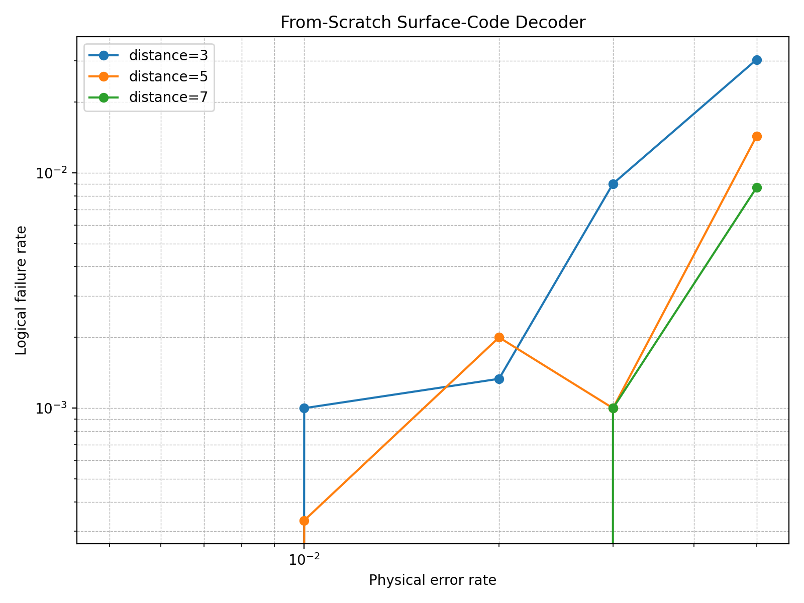
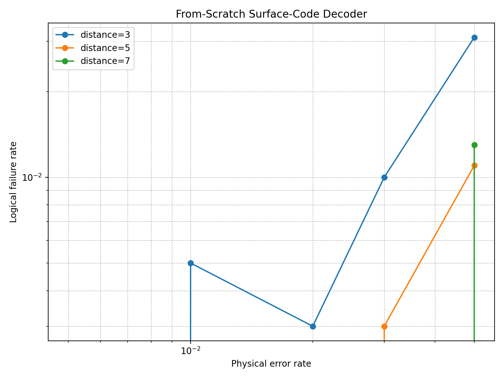
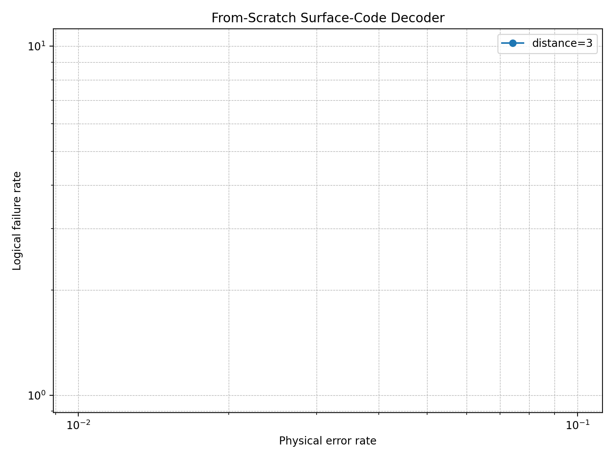
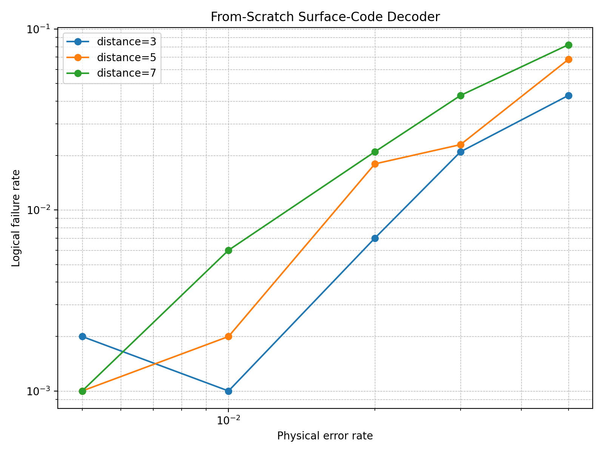
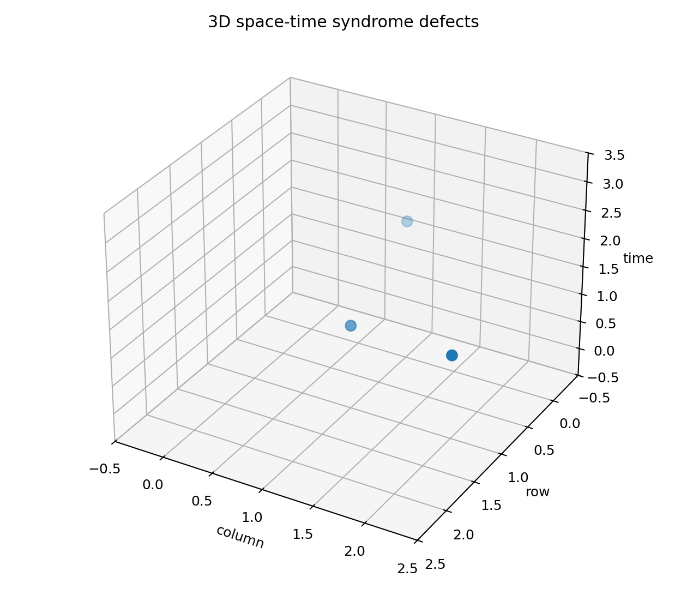
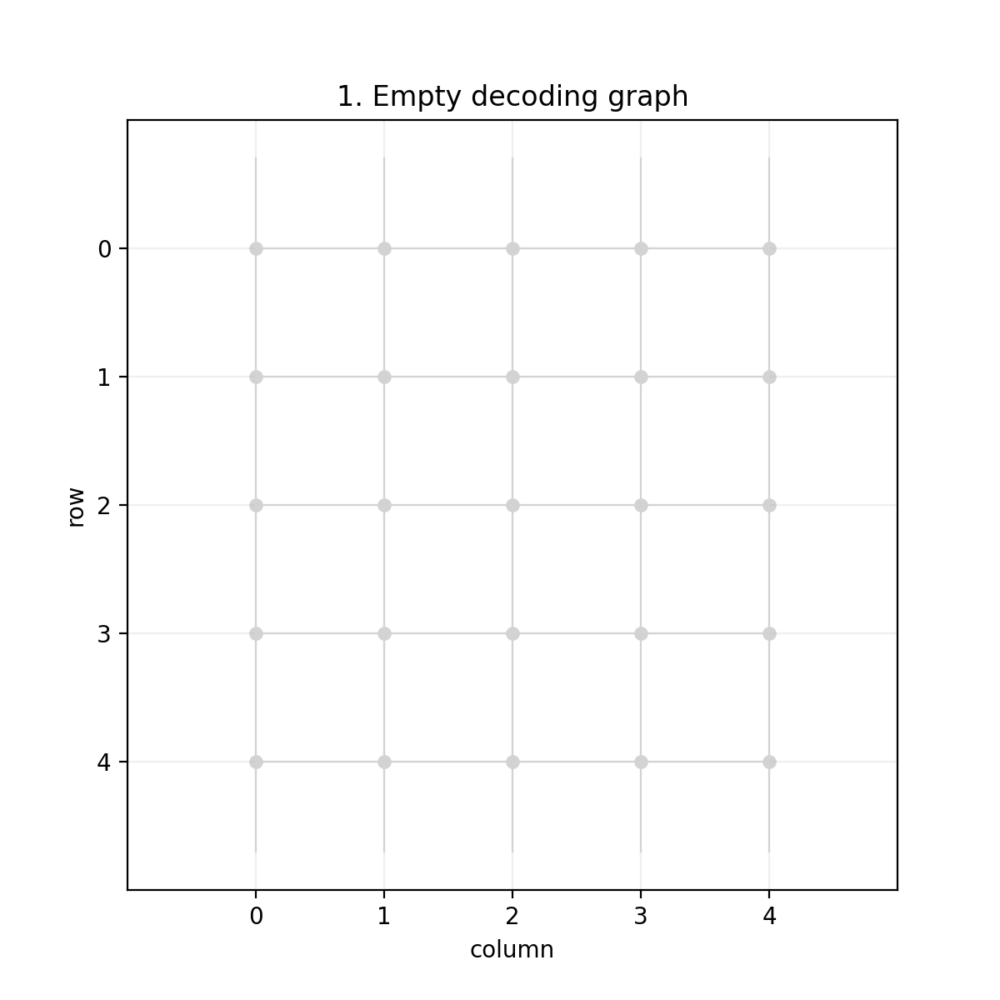

# Surface Code Decoder From Scratch

This repository contains an educational, from-scratch surface-code decoder implementation.

The goal is to build a small but readable quantum error correction workflow without relying on Stim or PyMatching for the core decoder. The main decoder constructs a simplified planar surface-code decoding graph, samples error chains, generates syndrome defects, decodes them, and estimates logical failure rates.

## Features

- From-scratch planar surface-code decoding graph
- From-scratch syndrome generation
- From-scratch exact brute-force MWPM decoder for small examples
- CSS-style X/Z separated decoding
- Educational Union-Find style decoder
- 3D space-time decoding graph for measurement-round demonstrations
- Optional comparison script with PyMatching
- Logical failure rate experiments
- Syndrome/correction-chain GIF animation
- Example notebooks

## Project Structure

```text
surface-code-decoder-from-scratch/
├── README.md
├── requirements.txt
├── requirements-pymatching.txt
├── src/
│   ├── lattice.py
│   ├── noise.py
│   ├── decoder.py
│   ├── evaluate.py
│   ├── spacetime.py
│   ├── pymatching_compare.py
│   ├── visualize.py
│   └── plot_results.py
├── scripts/
│   ├── run_experiment.py
│   ├── run_spacetime_demo.py
│   ├── compare_with_pymatching.py
│   └── make_animation.py
├── notebooks/
│   ├── single_shot_decoding_example.ipynb
│   └── css_xz_separation_example.ipynb
├── tests/
│   └── test_decoder.py
└── results/
```

## Setup

```bash
python3 -m venv .venv
source .venv/bin/activate
pip install --upgrade pip
pip install -r requirements.txt
```

## Run Tests

```bash
python -m pytest -q
```

Expected result:

```text
6 passed
```

## Basic Experiment

Run the original Z-error decoding experiment with the from-scratch MWPM decoder:

```bash
python scripts/run_experiment.py --distances 3 5 7 --shots 3000 --error-rates 0.005 0.01 0.02 0.03 0.05
```

Outputs:

```text
results/logical_failure_rate.csv
results/logical_failure_rate_plot.png
```



## CSS-style X/Z Separation

This project now supports two separated CSS components.

- `error_type="z"` uses top/bottom boundaries
- `error_type="x"` uses left/right boundaries
- `--css` samples and decodes independent X and Z errors

Run only the X-type component:

```bash
python scripts/run_experiment.py --distances 3 5 7 --shots 1000 --error-rates 0.005 0.01 0.02 0.03 0.05 --error-type x
```

Run CSS-style separated X/Z decoding:

```bash
python scripts/run_experiment.py --distances 3 5 7 --shots 1000 --error-rates 0.005 0.01 0.02 0.03 0.05 --css
```

Output example:

```text
results/css_mwpm_logical_failure_rate.csv
results/css_mwpm_logical_failure_rate_plot.png
```

## Union-Find Decoder

The repository includes an educational Union-Find style decoder. It uses a disjoint-set data structure to connect odd syndrome clusters until they become neutral or reach a boundary.

Run it with:

```bash
python scripts/run_experiment.py --distances 3 5 7 --shots 1000 --error-rates 0.005 0.01 0.02 0.03 0.05 --decoder union_find
```

For the X component:

```bash
python scripts/run_experiment.py --distances 3 5 7 --shots 1000 --error-rates 0.005 0.01 0.02 0.03 0.05 --decoder union_find --error-type x
```

## Measurement Rounds and 3D Space-Time Graph

The file `src/spacetime.py` implements a small phenomenological 3D decoding graph. Measurement errors create pairs of defects at the same spatial check in adjacent time layers, turning the 2D matching problem into a 3D space-time matching problem.

Run a small demo:

```bash
python scripts/run_spacetime_demo.py --distance 3 --rounds 4 --data-error-rate 0.03 --measurement-error-rate 0.02
```

Outputs:

```text
results/spacetime_defects.csv
results/spacetime_matching_summary.csv
results/spacetime_defects.png
```

## Optional PyMatching Comparison

The core project does not require PyMatching. To compare the from-scratch decoder with PyMatching, install the optional dependency:

```bash
pip install -r requirements-pymatching.txt
```

Then run:

```bash
python scripts/compare_with_pymatching.py --distance 3 --shots 100 --physical-error-rate 0.02
```

Output:

```text
results/pymatching_comparison.csv
```

## Animation

Generate a GIF showing syndrome defects, correction chains, and residual chains:

```bash
python scripts/make_animation.py --distance 5 --physical-error-rate 0.05 --seed 5
```

Output:

```text
results/syndrome_correction_animation.gif
```

## Notebooks

The `notebooks/` directory contains small explanatory notebooks:

- `single_shot_decoding_example.ipynb`
- `css_xz_separation_example.ipynb`

These notebooks are intended for GitHub readers who want to understand individual decoding examples.

## Method

This project models a simplified planar surface-code decoding graph. Elementary errors create syndrome defects by toggling the endpoints of decoding-graph edges. The decoder pairs defects with other defects or with boundaries, then converts those pairings into correction chains. A logical failure is detected by checking whether the residual chain has odd logical parity.

## Limitations

This is an educational implementation, not a production-grade quantum error correction simulator.

Current limitations:

- The exact MWPM decoder is exponential and only suitable for small distances
- The Union-Find decoder is educational and approximate
- The 3D space-time graph is phenomenological and compact
- The implementation is not a full stabilizer-circuit simulator
- Threshold estimates should not be treated as physical benchmark results

## Results

### Logical failure rate


### CSS-style separated decoding



### Union-Find decoder





### 3D space-time decoding graph



### Syndrome and correction animation



